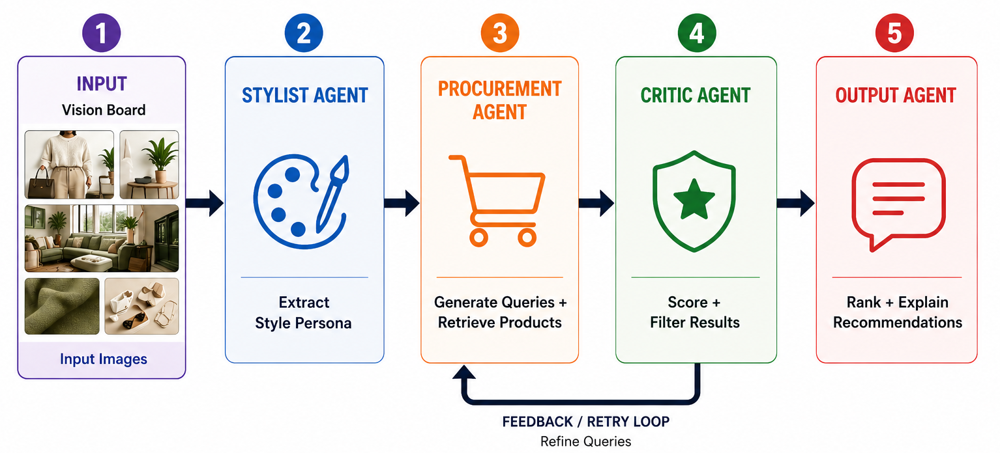

# VisionCart 🎨🛍️🛒

**Group Members:** Kurumi Kaneko, Quinton King, Raras Pramudita, Lance Santana

## Overview

Modern e-commerce remains anchored to keyword-based retrieval, a modality that often fails to capture the aesthetic preferences of individual users. Consumers already curate rich visual data on platforms like Pinterest, Instagram, and TikTok, yet these vision boards are disconnected from the point of purchase. This forces users to manually translate visual inspiration into text-based search queries, creating avoidable gaps between what they envision and what they can actually find. By leveraging multimodal models and agentic reasoning, VisionCart builds a personalized, intent-driven retail agent that reduces search friction and filters out products misaligned with a user's established taste profile.

---

## How It Works

VisionCart runs a four-agent pipeline:




| Agent | What it does |
|-------|-------------|
| **Stylist** | Analyzes Pinterest board images with Qwen2.5-VL-7B and produces a structured style persona (colors, materials, aesthetic tags, narrative) |
| **Procurement** | Uses an LLM (Ollama or HuggingFace) to generate aesthetic-forward search queries, then fetches live products from Google Shopping via SerpAPI |
| **Ranker/Critic** | Scores each product on text similarity, semantic match, and (optionally) image embedding similarity; rejects poor matches and generates actionable feedback for retry |
| **Output** | Calls a local Ollama LLM to produce a human-readable shopping summary and structured product cards |

### LangGraph Retry Loop

When running via `src/main-LG.py`, the pipeline adds an automatic feedback-and-retry loop orchestrated by LangGraph

After the ranker/critic scores all candidates, it checks whether any product scored above **0.6**. If not, it generates a `critic_feedback` string describing what went wrong — e.g. queries were too broad, accepted products were concentrated in one category, or key style signals were missing. Procurement reads this feedback on the next pass and generates different query angles to address the gaps.

This loop runs up to **3 total procurement attempts**. If the threshold is never met, the pipeline proceeds to output anyway and prepends a `LOW MATCH CONFIDENCE` warning to the summary.

---

## Demo

<video src="docs/visioncart_demo.mov" controls width="100%"></video>

> If the video doesn't render, [download it here](docs/visioncart_demo.mov).

---

## File Structure

```
VisionCart/
├── app.py                    ← Chainlit chat interface (frontend)
├── requirements.txt
├── .env                      ← API keys (not committed)
├── src/
│   ├── main-LC.py            ← Sequential chain pipeline (CLI)
│   ├── main-LG.py            ← LangGraph pipeline with retry loop (CLI)
│   ├── agents/
│   │   ├── stylist.py        ← Qwen2.5-VL-7B vision model
│   │   ├── procurement.py    ← LLM query gen + SerpAPI product search
│   │   ├── ranker_critic.py  ← Scoring, filtering, and critic feedback
│   │   └── output.py         ← Ollama narrative summary + product cards
│   ├── tools/
│   │   └── api.py            ← SerpAPI wrapper
│   ├── graph/
│   │   └── state.py          ← AgentState TypedDict
│   └── utils/
│       ├── pinterest_crawler.py
│       ├── clip_embeddings.py
│       └── helper.py
├── tests/
│   ├── test_eval.py          ← Style definitions + eval harness
│   └── test_stylist_agent.py
├── data/                     ← Downloaded Pinterest board images (runtime, git-ignored)
├── dataset/                  ← Eval datasets and product images
├── docs/                     ← Agent guides (see below)
├── notebooks/                ← EDA and experimentation
└── results/                  ← Eval output logs
```

---

## Setup

### 1. Clone the repo

```bash
git clone https://github.com/kurumigithub/VisionCart.git
cd VisionCart
```

### 2. Install PyTorch (do this first)

PyTorch must be installed separately before the rest of the dependencies because the correct build depends on your hardware:

```bash
# NVIDIA GPU (CUDA 12.1)
pip install torch torchvision --index-url https://download.pytorch.org/whl/cu121

# Apple Silicon (MPS)
pip install torch torchvision

# CPU only
pip install torch torchvision --index-url https://download.pytorch.org/whl/cpu
```

### 3. Install dependencies

```bash
pip install -r requirements.txt
```

### 4. Set up environment variables

Create a `.env` file at the repo root:

```bash
# .env

# Required for product search (all pipeline modes)
SERPAPI_API_KEY=your_serpapi_key_here

# LLM backend — choose one:

# Option A: Local Ollama (recommended for local runs)
OLLAMA_MODEL=qwen2.5:7b
OLLAMA_HOST=http://localhost:11434   # default, can omit

# Option B: HuggingFace Inference API for query generation (procurement + output)
# Also used by the stylist agent to authenticate the Qwen2.5-VL-7B model download
HF_TOKEN=your_huggingface_token_here
```

If both `OLLAMA_MODEL` and `HF_TOKEN` are set, Ollama takes priority. If neither is set, Ollama is used with the default model (`qwen2.5:7b`).

### 5. Start Ollama (if using local LLM)

```bash
ollama pull qwen2.5:7b
ollama serve
```

---

## Running The Pipeline

### Option A — Sequential chain (`src/main-LC.py`)

Simple linear execution: stylist → procurement → ranker/critic → output. No retry logic. Best for debugging and step-by-step testing.

```bash
# Requires: GPU (≥14 GB VRAM), SERPAPI_API_KEY, and OLLAMA_MODEL or HF_TOKEN
python src/main-LC.py https://www.pinterest.com/username/board-name/
python src/main-LC.py https://www.pinterest.com/username/board-name/ --max-images 1
```

The URL is a required positional argument. `--max-images` controls how many Pinterest images are downloaded (default `5`; the stylist caps usage at 5 regardless).

### Option B — LangGraph with retry loop (`src/main-LG.py`)

Runs the same four agents as a LangGraph state graph. After the critic scores products, if the best match score is ≤ 0.6, procurement is called again with the critic's feedback — up to 3 total attempts. If the threshold is never met, the output agent prepends `LOW MATCH CONFIDENCE` to the summary.

```bash
# Same requirements as Option A
python src/main-LG.py
```

The board URL is currently hardcoded at line 176 of `main-LG.py` — edit it before running.

**When to use which:**

| | Chain (`main-LC.py`) | Graph (`main-LG.py`) |
|--|---------------------|---------------------|
| Retry on poor results | No | Yes (up to 3 passes) |
| CLI argument for URL | Yes (`python ... <url>`) | No (hardcoded) |
| Good for | Debugging, testing agents | Production-like runs |

---

## Frontend (Chainlit)

The Chainlit app provides a chat interface that runs the procurement → ranker/critic → output pipeline without the stylist agent. The user picks a predefined aesthetic style and types what they are looking for; the LLM generates queries from that combination.

The Chainlit frontend implements its own single-retry variant of this loop: if `critic_feedback` is set after the first rank pass, it runs a second procurement pass and re-ranks the combined candidate pool before generating output.

The Chainlit frontend skips the stylist and uses predefined style profiles instead — the user picks a style (Dark Academia, Cottagecore, etc.) and types what they are looking for.


### Start the frontend

```bash
chainlit run app.py
```

Then open [http://localhost:8000](http://localhost:8000) in your browser.

### How it works

1. **Type a product** — e.g. `bag`, `blazer`, `candle`, `shoes`
2. **Pick a style** — choose from 10 aesthetic profiles by number or name:
   - `1` Dark Academia
   - `2` Quiet Luxury
   - `3` Y2K Streetwear
   - `4` Coastal Mediterranean
   - `5` Maximalist Eclectic
   - `6` Dark Moody Organic
   - `7` Mid Century Modern
   - `8` Vintage Bohemian
   - `9` Japandi
   - `10` Cottagecore
3. **Pipeline runs automatically** — status messages stream as each stage completes:
   - LLM generates 3 aesthetic search queries
   - SerpAPI fetches live Google Shopping results (15 per query)
   - Ranker/critic scores and filters candidates
   - If critic feedback is triggered → second procurement pass with refined queries
   - Output agent writes a shopping narrative
4. **Product cards appear** — each accepted product shows name, price, tags, match score, and a product image

### Requirements for the frontend

- `SERPAPI_API_KEY` in `.env`
- `OLLAMA_MODEL` or `HF_TOKEN` in `.env`
- No GPU required — the stylist agent is not used
- Ollama must be running if `OLLAMA_MODEL` is set

---

## Verify GPU (required for full pipeline with stylist)

```python
import torch
print(torch.cuda.is_available())    # must be True on CUDA machines
print(torch.cuda.get_device_name(0))
```

The stylist agent requires ≥14 GB VRAM (Google Colab T4/A100 works). The frontend and chain/graph pipelines without the stylist have no GPU requirement.

---

## Documentation

| Guide | File |
|-------|------|
| Sequential chain pipeline (`main-LC.py`) | [docs/chain_pipeline_guide.md](docs/chain_pipeline_guide.md) |
| LangGraph pipeline with retry (`main-LG.py`) | [docs/graph_pipeline_guide.md](docs/graph_pipeline_guide.md) |
| Stylist agent | [docs/stylist_agent_guide.md](docs/stylist_agent_guide.md) |
| Procurement agent | [docs/procurement_agent_guide.md](docs/procurement_agent_guide.md) |
| Ranker/Critic agent | [docs/ranker_critic_agent_guide.md](docs/ranker_critic_agent_guide.md) |
| Output agent | [docs/output_agent_guide.md](docs/output_agent_guide.md) |
